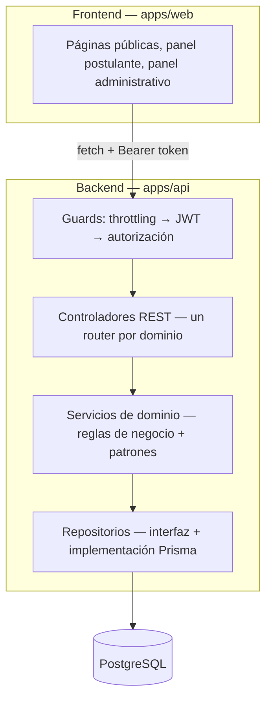
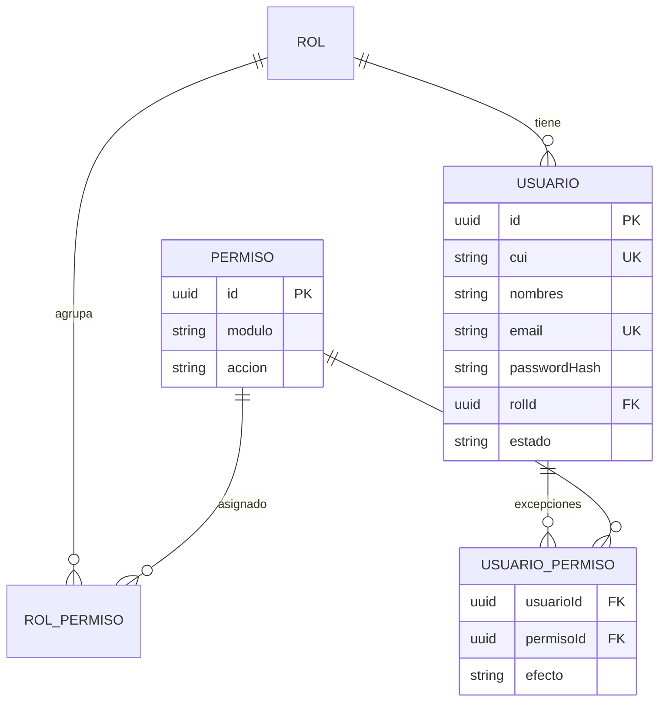
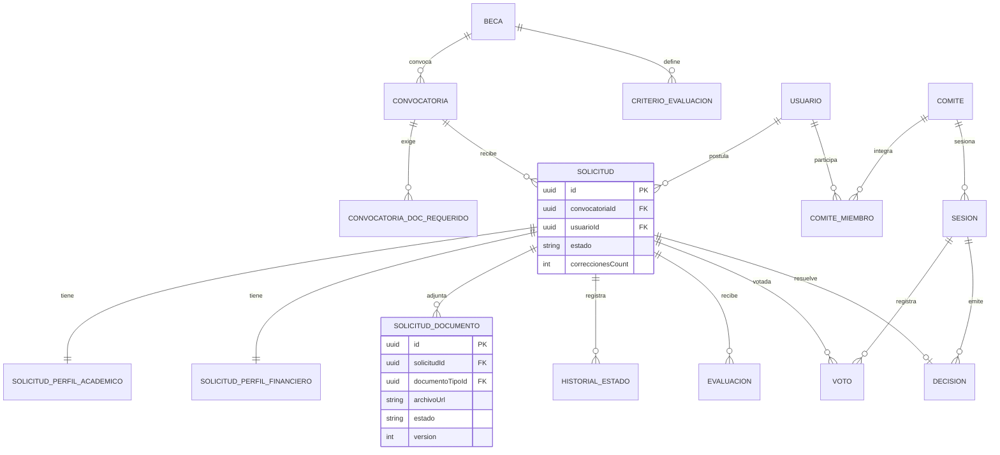
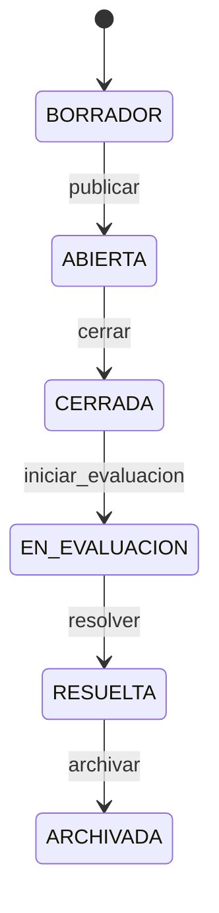
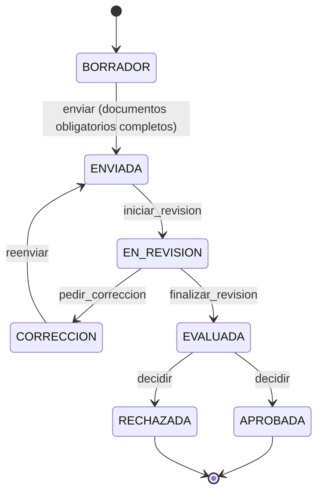

# SIGEB

> Nombre de trabajo sugerido . Si el equipo prefiere otro
> nombre, basta con reemplazarlo aquí; el resto del documento no depende del nombre.

Plataforma para que el Ministerio de Educación administre el ciclo completo de una beca: publicación de
convocatorias, postulación de estudiantes, carga y revisión de documentos, evaluación, decisión de comités
evaluadores, y consulta de estado — con una matriz de seguridad configurable por rol y por usuario, y un
asistente de IA que responde de forma distinta según si hay sesión iniciada y qué rol tiene quien pregunta.

Este documento es la referencia técnica para arrancar la construcción del proyecto: arquitectura, patrones
de diseño, stack, modelo de datos, seguridad y endpoints. Está pensado como el "documento de arquitectura +
diseño" inicial, no como documentación de una API ya construida.

---

## 1. Alcance funcional

Requisitos obligatorios del proyecto, ya cubiertos por este diseño:

- Administrar convocatorias
- Registrar estudiantes (postulantes) con CUI/DPI único
- Gestionar solicitudes con perfil personal, académico y financiero
- Cargar documentación, con requisitos configurables por convocatoria
- Administrar evaluaciones con criterios ponderados
- Gestionar comités evaluadores (sesiones, quórum, votación)
- Aprobar o rechazar solicitudes
- Consultar el estado de una beca
- Generar reportes básicos (para personal interno, no para postulantes)

Extendido según los últimos requerimientos del Product Owner:

- Asistente de IA con alcance de respuesta distinto según sesión y rol
- Matriz de seguridad: permisos por rol **y** excepciones por usuario individual
- Prevención explícita de inyección SQL y otras validaciones de seguridad
- CUI/DPI obligatorio y único al registrar un postulante
- Catálogos (género, nivel académico, departamento, municipio) con opción "otro" habilitada solo al
  seleccionarla
- Formulario de solicitud con documentos requeridos variables por convocatoria, validación de completitud
  antes de poder aplicar, y opción de quitar/reemplazar un documento antes del envío

Explícitamente **fuera de alcance** en esta versión (a diferencia del sistema de referencia analizado):
pagos y conciliación bancaria, contratos y formalización, renovaciones, lista de espera, autenticación de
dos factores, almacenamiento en la nube, generación de PDF con navegador headless, múltiples idiomas,
búsqueda vectorial. Todo esto queda como trabajo futuro documentado en el backlog, no como deuda oculta.

---

## 2. Arquitectura

**Monolito modular por capas**, dos aplicaciones independientes que hablan por HTTP/JSON.

```
sabe/
├── apps/
│   ├── api/     → backend NestJS, expone REST en /api
│   └── web/     → frontend Next.js, consume la API
├── docker-compose.yml
└── package.json
```



Cada dominio (convocatorias, postulantes, solicitudes, documentos, evaluaciones, comités, seguridad,
reportes, asistente) es un módulo autocontenido: `*.controller.ts`, `*.service.ts`, `*.repository.ts`,
`dto/`. Los servicios dependen de **interfaces** de repositorio, no de Prisma directamente — esto es lo que
permite justificar bajo acoplamiento y facilidad de cambio futuro sin necesitar microservicios.

### Justificación de la arquitectura

| Criterio | Cómo lo resuelve este diseño |
|---|---|
| Mantenibilidad | Cada dominio vive en su propio módulo; cambiar reglas de evaluación no toca comités ni documentos |
| Escalabilidad | Monolito modular evita la complejidad operativa de microservicios que este alcance no justifica; cualquier módulo puede extraerse después si el volumen lo exige |
| Bajo acoplamiento | Servicios dependen de interfaces de repositorio (Dependency Inversion), no de la implementación concreta de la base de datos |
| Reutilización | Catálogos, autorización y auditoría son transversales y se inyectan donde se necesitan, no se duplican |
| Facilidad de cambios futuros | El proveedor de IA, el almacenamiento de documentos y el motor de notificaciones están detrás de interfaces intercambiables |
| Complejidad proporcional al alcance | ~9 módulos de dominio, no 24 — proporcional a lo que el enunciado pide, con margen para lo agregado (IA, matriz de seguridad) |

---

## 3. Patrones de diseño

8 patrones con evidencia de uso real en el dominio (2 más del mínimo exigido, producto de los requisitos de
seguridad y de IA agregados).

### Creacionales

| Patrón | Dónde se usa | Problema que resuelve | Alternativas consideradas | Ventaja |
|---|---|---|---|---|
| **Singleton** | Servicio de conexión a base de datos, compartido por toda la aplicación | Evitar múltiples pools de conexión y estado inconsistente entre módulos | Instanciar el cliente en cada servicio | Una sola fuente de verdad para la conexión; más fácil de testear con mocks |
| **Builder** | Construcción de la `Solicitud` (perfil personal + académico + financiero + documentos), llenada en pasos distintos del formulario | El objeto final tiene muchos campos opcionales que se completan en momentos distintos y deben validarse por sección | Constructor con todos los parámetros de una vez, o setters sueltos sin validación | Cada sección se valida de forma independiente antes de ensamblar el objeto final; el formulario multi-paso del frontend mapea 1:1 con los pasos del builder |

### Estructurales

| Patrón | Dónde se usa | Problema que resuelve | Alternativas consideradas | Ventaja |
|---|---|---|---|---|
| **Facade** | `SolicitudLifecycleService`: orquesta validar transición de estado, actualizar registro, registrar historial y emitir evento en una sola llamada | El controlador no debe conocer los pasos internos de aprobar/rechazar/enviar una solicitud | Que el controlador llame cada paso por separado | Centraliza la lógica, evita duplicarla en cada endpoint, respeta responsabilidad única |
| **Adapter** | Interfaz `DocumentStorage` con implementación de filesystem local | La lógica de negocio no debe depender de dónde/cómo se guardan los archivos | Llamar directo a `fs` desde los servicios | Permite cambiar a almacenamiento en la nube después sin tocar la lógica de negocio |
| **Proxy** | `AsistenteIAProxy`: intercepta cada pregunta al asistente, resuelve sesión y rol, arma el contexto permitido, y solo entonces delega al proveedor real de IA | El modelo de lenguaje no debe tener acceso directo a datos de otros usuarios ni ejecutar consultas libres | Llamar al proveedor de IA directamente desde el controlador | El control de acceso queda en un solo punto obligatorio de paso; imposible saltárselo por accidente en un nuevo endpoint |

### De comportamiento

| Patrón | Dónde se usa | Problema que resuelve | Alternativas consideradas | Ventaja |
|---|---|---|---|---|
| **State** | Máquinas de estado de `Convocatoria` y `Solicitud`, con tabla de transiciones válidas | Evitar transiciones inválidas (ej. de RECHAZADA a APROBADA) y lógica de estado dispersa en condicionales | Campo de texto libre validado con `if` en cada servicio | Regla de negocio centralizada, testeable de forma aislada, imposible de saltarse |
| **Observer** | Eventos de dominio (`solicitud.enviada`, `solicitud.evaluada`, `sesion.finalizada`) que disparan notificaciones y auditoría sin acoplarse al servicio que los emite | Desacoplar "qué pasó" de "quién debe reaccionar" | Llamar directamente al servicio de notificaciones desde cada servicio de negocio | Se pueden agregar nuevos "reaccionadores" (ej. auditoría) sin tocar el código que emite el evento |
| **Chain of Responsibility** | Resolución de permisos: primero se revisa si existe una excepción de usuario (`UsuarioPermiso`); si no existe, se revisa el permiso del rol; si tampoco aplica, se deniega por defecto | La matriz de seguridad necesita resolver, para cada petición, cuál de dos fuentes de permiso manda | Un único `if` gigante mezclando reglas de rol y de usuario | Cada eslabón resuelve o delega; agregar una tercera fuente de permisos (ej. por convocatoria) no rompe las dos anteriores |

---

## 4. Stack tecnológico

| Capa | Tecnología | Nota |
|---|---|---|
| Frontend | Next.js (App Router) + React, Tailwind CSS con sistema de diseño propio | Identidad visual distinta al sistema de referencia analizado |
| Formularios | React Hook Form + Zod | Necesario para el formulario multi-sección con lógica "otro" y validación de documentos obligatorios |
| Backend | NestJS + TypeScript | Módulos + inyección de dependencias facilitan Adapter/Facade/Proxy sin contenedor de DI manual |
| ORM | Prisma | Consultas parametrizadas por defecto → primera línea de defensa contra inyección SQL |
| Base de datos | PostgreSQL | Búsqueda de texto (`tsvector`) para la base de conocimiento del asistente, sin necesitar extensión vectorial |
| Autenticación | Passport + JWT (access/refresh) + bcrypt | Sin 2FA en esta versión |
| Autorización | Guard de permisos con Chain of Responsibility sobre rol + excepciones de usuario | Ver sección 6 |
| Almacenamiento de documentos | Filesystem local detrás de `DocumentStorage` (Adapter) | Migrable a almacenamiento en la nube sin tocar servicios |
| IA | Proveedor configurable (Gemini/OpenAI) detrás de `AsistenteIAProxy` (Strategy + Proxy) | Sin RAG vectorial; base de conocimiento estructurada |
| Reportes | Consultas agregadas + exportación CSV | Sin librerías de gráficos pesadas |
| Testing | Jest + Supertest (API), Playwright (E2E web) | |
| CI | GitHub Actions: lint + test en cada Pull Request | |
| Infra local | Docker Compose (PostgreSQL) | |

---

## 5. Modelo de datos

### Seguridad y usuarios



`efecto` en `USUARIO_PERMISO` es `PERMITIR` o `DENEGAR`: permite tanto ampliar como restringir un permiso
puntual para un usuario específico, por encima de lo que su rol define por defecto.

### Dominio de becas



### Catálogos con opción "otro"

Cada catálogo (`Genero`, `NivelAcademico`, `Departamento`, `Municipio`) se referencia desde el perfil del
postulante con dos columnas: `xxxId` (nullable, referencia al catálogo) y `xxxOtro` (nullable, texto libre).
Regla de negocio: exactamente una de las dos debe estar llena. `Municipio` referencia a `Departamento` para
el dropdown en cascada.

### Entidades adicionales

- `AuditLog`: usuario, acción, entidad afectada, detalle, fecha — quién cambió qué, incluyendo cambios en la
  matriz de permisos.
- `AsistenteBaseConocimiento`: preguntas/respuestas o fragmentos de ayuda indexados por texto completo.
- `AsistenteConversacion` / `AsistenteMensaje`: historial de interacciones, para poder auditar qué contexto
  vio el asistente en cada respuesta.

---

## 6. Seguridad

### Matriz de permisos (rol + usuario)

- Permisos con convención `modulo:accion`, por ejemplo `solicitud:ver`, `solicitud:editar`,
  `documento:eliminar`, `reporte:ver`, `permiso:editar`.
- `RolPermiso` define la base por rol.
- `UsuarioPermiso` define excepciones puntuales (`PERMITIR` amplía, `DENEGAR` restringe) para un usuario
  específico, sin tener que crear un rol nuevo para un caso aislado.
- Resolución vía **Chain of Responsibility**: excepción de usuario → permiso de rol → denegado por defecto.
- Toda edición de la matriz queda en `AuditLog`.
- Solo `ADMIN` (o quien tenga `permiso:editar`) puede modificar la matriz.

### Roles base sugeridos

| Rol | Descripción |
|---|---|
| `ADMIN` | Acceso total, incluida la matriz de seguridad |
| `POSTULANTE` | Crea y gestiona su propia solicitud |
| `EVALUADOR` | Evalúa solicitudes asignadas |
| `COORDINADOR_COMITE` | Convoca sesiones, registra decisiones |
| `MIEMBRO_COMITE` | Vota en sesiones |
| `STAFF` | Rol base para personal administrativo; sus permisos reales se afinan mayormente vía excepciones de usuario |

### Prevención de inyección SQL y otras validaciones

- Prisma con consultas parametrizadas por defecto; prohibido usar `$queryRawUnsafe` o concatenar valores de
  usuario en SQL. Si se necesita SQL crudo, únicamente `$queryRaw` con template literals (parametrizado).
- DTOs con `class-validator`/Zod en cada endpoint: whitelist de campos, tipos correctos, longitudes máximas.
- El asistente de IA nunca genera ni ejecuta SQL: solo llama a métodos de repositorio ya parametrizados
  (ver Proxy en sección 3).
- Autorización por fila: un postulante solo puede leer/editar su propia solicitud, validado en el servicio,
  no solo en el controlador.
- Archivos: validación de tipo MIME y tamaño antes de guardar, nombre de archivo generado (no el original),
  descarga solo vía endpoint autenticado.
- Contraseñas con `bcrypt`, límite de intentos de login (throttling).
- Campos sensibles (CUI, datos financieros) cifrados en reposo además de protegidos por permisos.

---

## 7. Lógica de negocio

### Ciclo de vida de la convocatoria



### Ciclo de vida de la solicitud



Reglas clave:
- Solo el dueño de la solicitud puede editarla, y solo en `BORRADOR` o `CORRECCION`.
- El envío exige que la convocatoria esté `ABIERTA`, dentro de fechas, y que **todos** los documentos
  obligatorios de esa convocatoria estén cargados — si falta alguno, se bloquea el envío y se indica cuál.
- Antes del envío, el postulante puede quitar o reemplazar cualquier documento ya subido; la UI siempre
  muestra la lista de documentos cargados con su estado.
- Un evaluador no puede evaluar su propia solicitud (chequeo de imparcialidad).

### Evaluación y comité

1. Se asignan evaluadores a una solicitud en `EN_REVISION`.
2. Cada evaluador puntúa por criterio (pesos definidos por beca); al completar se calcula el score
   ponderado.
3. Con todas las evaluaciones requeridas completas, la solicitud pasa a `EVALUADA`.
4. El comité convoca una sesión con agenda de solicitudes `EVALUADA`.
5. Cada miembro vota una sola vez por solicitud.
6. Al finalizar la sesión se valida quórum (`floor(miembros/2)+1`); las solicitudes pasan a
   `APROBADA`/`RECHAZADA` y se registra la `Decision`.

### Asistente de IA por sesión y rol

| Quién pregunta | Qué puede responder |
|---|---|
| Visitante sin sesión | Preguntas generales: requisitos, convocatorias abiertas, cómo aplicar |
| Postulante logeado | Lo anterior + estado de **su propia** solicitud y documentos pendientes |
| Evaluador / miembro de comité | Lo anterior (parte pública) + **sus** evaluaciones/sesiones pendientes, nunca datos de otros usuarios |
| Admin / Staff con permiso | Estadísticas agregadas |

Todo pasa por `AsistenteIAProxy`, que arma el contexto permitido antes de invocar al proveedor de IA — el
modelo nunca consulta la base de datos directamente.

### Reportes (uso interno, no para postulantes)

Protegidos por el permiso `reporte:ver` (asignable vía matriz de seguridad, no atado a un rol fijo).
Contenido base: conteo de solicitudes por estado, convocatorias abiertas/cerradas, evaluaciones pendientes
vs. completadas, aprobadas/rechazadas por convocatoria — exportable a CSV.

---

## 8. Endpoints principales

Todas las rutas van bajo `/api`. `[permiso]` indica el permiso mínimo requerido; los endpoints marcados
`(público)` no requieren sesión.

### Autenticación (`/auth`)

| Método | Ruta | Descripción |
|---|---|---|
| POST | `/auth/registro` | Registro de postulante — valida unicidad de CUI y correo (público) |
| POST | `/auth/login` | Inicio de sesión (público) |
| POST | `/auth/refresh` | Renovación de token |
| GET | `/auth/perfil` | Perfil del usuario autenticado |

### Convocatorias (`/convocatorias`)

| Método | Ruta | Permiso |
|---|---|---|
| GET | `/convocatorias` | público (solo abiertas) / `convocatoria:ver` (todas) |
| GET | `/convocatorias/:id` | público / `convocatoria:ver` |
| GET | `/convocatorias/:id/requisitos` | público — documentos requeridos para aplicar |
| POST | `/convocatorias` | `convocatoria:crear` |
| PATCH | `/convocatorias/:id` | `convocatoria:editar` |
| POST | `/convocatorias/:id/transicion` | `convocatoria:editar` |

### Solicitudes (`/solicitudes`)

| Método | Ruta | Permiso |
|---|---|---|
| POST | `/solicitudes` | `solicitud:crear` (postulante crea la propia) |
| GET | `/solicitudes/mias` | postulante autenticado |
| GET | `/solicitudes/:id` | dueño, o `solicitud:ver` |
| PATCH | `/solicitudes/:id/perfil-academico` | dueño, solo en `BORRADOR`/`CORRECCION` |
| PATCH | `/solicitudes/:id/perfil-financiero` | dueño, solo en `BORRADOR`/`CORRECCION` |
| POST | `/solicitudes/:id/documentos` | dueño — sube/reemplaza un documento |
| DELETE | `/solicitudes/:id/documentos/:docId` | dueño — quita un documento antes de enviar |
| GET | `/solicitudes/:id/checklist` | dueño — qué documentos faltan para poder enviar |
| POST | `/solicitudes/:id/enviar` | dueño — valida completitud antes de transicionar |
| POST | `/solicitudes/:id/transicion` | `solicitud:editar` |

### Documentos (`/documentos-tipo`)

| Método | Ruta | Permiso |
|---|---|---|
| GET | `/documentos-tipo` | `documento:ver` |
| POST | `/documentos-tipo` | `documento:crear` |

### Evaluaciones (`/evaluaciones`)

| Método | Ruta | Permiso |
|---|---|---|
| GET | `/evaluaciones/asignadas` | evaluador autenticado |
| POST | `/evaluaciones/:solicitudId/asignar` | `evaluacion:crear` |
| PATCH | `/evaluaciones/:id/puntajes` | evaluador dueño de la evaluación |

### Comités (`/comites`)

| Método | Ruta | Permiso |
|---|---|---|
| GET | `/comites` | `comite:ver` |
| POST | `/comites/:id/sesiones` | `comite:crear` |
| POST | `/sesiones/:id/votos` | miembro del comité |
| POST | `/sesiones/:id/finalizar` | `comite:editar` — valida quórum y genera decisiones |

### Seguridad (`/seguridad`)

| Método | Ruta | Permiso |
|---|---|---|
| GET | `/seguridad/roles` | `permiso:editar` |
| GET | `/seguridad/permisos` | `permiso:editar` |
| PATCH | `/seguridad/roles/:id/permisos` | `permiso:editar` |
| PATCH | `/seguridad/usuarios/:id/permisos` | `permiso:editar` — excepciones por usuario |
| GET | `/seguridad/auditoria` | `permiso:editar` |

### Catálogos (`/catalogos`)

| Método | Ruta | Descripción |
|---|---|---|
| GET | `/catalogos/generos` | público |
| GET | `/catalogos/niveles-academicos` | público |
| GET | `/catalogos/departamentos` | público |
| GET | `/catalogos/municipios?departamentoId=` | público — dropdown en cascada |

### Reportes (`/reportes`)

| Método | Ruta | Permiso |
|---|---|---|
| GET | `/reportes/resumen` | `reporte:ver` |
| GET | `/reportes/solicitudes.csv` | `reporte:ver` |

### Asistente (`/asistente`)

| Método | Ruta | Permiso |
|---|---|---|
| POST | `/asistente/preguntar` | público (respuesta acotada) / autenticado (respuesta ampliada según rol) |

---

## 9. Estructura de carpetas propuesta

```
apps/api/src/
├── main.ts
├── app.module.ts
├── common/                  guards, decoradores, interceptor de auditoría
├── auth/                    registro, login, refresh, perfil
├── seguridad/               roles, permisos, excepciones por usuario (matriz)
├── catalogos/               género, nivel académico, departamento, municipio
├── becas/                   catálogo de becas y criterios de evaluación
├── convocatorias/           convocatorias + máquina de estados + documentos requeridos
├── solicitudes/             solicitud + perfil académico/financiero + documentos + máquina de estados
├── documentos/              tipos de documento + storage (adapter fs)
├── evaluaciones/            asignación, puntajes, score ponderado
├── comites/                 comités, sesiones, votos, quórum
├── decisiones/              aprobación/rechazo
├── reportes/                agregaciones + export CSV
├── asistente/                proxy de IA + base de conocimiento
├── auditoria/               log de acciones sensibles
└── prisma/                  servicio de conexión (singleton)
```

---

## Pagina Publica
Debe de hace rmencion al MINEDUC, pero el nombre que tiene el sitema es SIGEB, sera una pagina publica la cua
contara con la informacion como misio, visio, objetivos, muesstra de infoacn de como es que funcionar, 
ademas de contar con el acceso hacia el sistema de SIGEB desde la pagina, agregar todo lo neceario para la paigna publica

## Diseño
Colores

Una paleta inspirada en la identidad institucional/guatemalteca:

Azul institucional
#0057B8
Azul profundo
#003B73
Celeste
#4DA3D9
Blanco
#FFFFFF
Gris claro
#F4F7FA
Dorado/acento
#D4A72C

El celeste puede utilizarse para conectar visualmente con Guatemala, mientras que el azul mantiene una apariencia institucional.
La regla sería:
80% → blancos / grises
15% → azul
5%  → celeste / acento

Liquid Glass, pero institucional Lo utilizaría únicamente en elementos destacados. backdrop-blur
transparencias
bordes suaves
gradientes muy ligeros
blobs/figuras abstractas
sombras suaves
. Hero que tenga contexto

No pondría:

"Welcome to SIGEB"

Eso es demasiado genérico.

Pondría algo como:

Oportunidades que transforman vidas

Encuentra programas de becas del Ministerio de Educación de Guatemala y realiza tu proceso de postulación de forma sencilla, segura y transparente.

[ Explorar becas ]

[ Consultar mi solicitud ]

Y al lado:

          ┌───────────────────────┐
          │                       │
          │       ✦               │
          │    BECAS 2026         │
          │                       │
          │    Tu educación       │
          │    es el futuro       │
          │                       │
          └───────────────────────┘
5. Agregaría una sección "Sobre SIGEB"

Esto es importante para el contexto del proyecto.

Sobre SIGEB

SIGEB es la plataforma para la gestión integral
de programas de becas del Ministerio de Educación
de Guatemala.

Nuestro objetivo es facilitar un proceso:

       Transparente       Seguro
             \              /
              \            /
                Accesible

Y tres elementos:

          ✓
    Información clara

          ✓
    Seguimiento de solicitudes

          ✓
    Proceso transparente

Esto conecta directamente con el problema planteado en el enunciado.

6. Sección "¿Cómo funciona?"

Aquí puedes convertir el ciclo de vida de la beca en una experiencia visual.

¿Cómo solicitar una beca?

01                  02                 03

REGÍSTRATE    →    POSTÚLATE     →    DOCUMENTA
Crea tu        Selecciona una       Carga los
cuenta         convocatoria         requisitos

       ↓

04                  05                 06

EVALUACIÓN    →    COMITÉ       →    RESULTADO

Tu solicitud       Se revisa        Consulta tu
es evaluada        tu expediente    resolución

Esto además ayuda a explicar el sistema al usuario.

7. Convocatorias públicas

Esta debería ser una sección central.

Convocatorias abiertas

┌─────────────────────────────────────────────────┐
│ Beca de Excelencia Académica                    │
│                                                 │
│ Nivel: Universitario                            │
│ Cobertura: Nacional                             │
│ Cierre: 30 septiembre 2026                      │
│                                                 │
│ ████████████████████░░                         │
│                                                 │
│ [ Consultar convocatoria ]                      │
└─────────────────────────────────────────────────┘

Puedes agregar filtros:

[ Nivel académico ▼ ]
[ Departamento ▼ ]
[ Tipo de beca ▼ ]
[ Estado ▼ ]

Y búsqueda.

Esto cumple directamente:

Administrar convocatorias.

8. Página individual de una convocatoria

Aquí podemos hacer algo bastante elegante.

← Convocatorias

BECAS 2026

Beca de Excelencia Académica

       ABIERTA

Apoyo dirigido a estudiantes con
alto rendimiento académico.

────────────────────────────────────

Información

Nivel
Universitario

Cobertura
Nacional

Fecha de apertura
01 agosto 2026

Fecha de cierre
30 septiembre 2026

────────────────────────────────────

Requisitos

✓ Ser ciudadano guatemalteco
✓ Estar inscrito en una institución
✓ Presentar certificación académica
✓ Cumplir criterios socioeconómicos

                         [ Postularme ]
9. "Consulta tu beca"

Esta podría ser una función pública muy buena.

En la página:

¿Ya realizaste tu solicitud?

Consulta el estado de tu beca.

[ SIG-2026-00124             ]

[ Consultar ]

Pero para información sensible:

→ Iniciar sesión para ver expediente completo

Así la plataforma tiene utilidad incluso para personas que todavía no tienen cuenta.

10. Página "Nosotros"

No solamente:

"SIGEB es una aplicación."

Sino:

Ministerio de Educación

Trabajamos para fortalecer el acceso a oportunidades educativas para estudiantes guatemaltecos.

Luego:

Nuestra misión
Nuestra visión
Programas de becas
Transparencia

Y una sección:

¿Necesitas ayuda?

Centro de atención

📞 Teléfono
📧 Correo
📍 Guatemala

[ Contactarnos ]
11. Footer institucional

También evitaría el típico:

© 2026 SIGEB

Haría:

────────────────────────────────────────────────

SIGEB
Sistema Integral de Gestión de Becas

Ministerio de Educación
República de Guatemala

INSTITUCIONAL
Inicio
Sobre SIGEB
Transparencia
Contacto

BECAS
Convocatorias
Requisitos
Preguntas frecuentes

AYUDA
Centro de ayuda
Consultar solicitud
Soporte

────────────────────────────────────────────────

© 2026 Ministerio de Educación de Guatemala
Todos los derechos reservados.


Responsive desde el principio

Esto sí lo considero importante.

No diseñaría primero desktop y después "lo hago responsive".

Diseñaría:

Desktop
      ↓
Tablet
      ↓
Mobile

Por ejemplo, en móvil:

┌──────────────────────┐
│ ☰    SIGEB       ◉   │
├──────────────────────┤
│                      │
│ Oportunidades que    │
│ transforman vidas    │
│                      │
│ [ Ver becas ]        │
│                      │
├──────────────────────┤
│ Convocatorias        │
│                      │
│ ┌──────────────────┐ │
│ │ Beca Universitaria│ │
│ │                  │ │
│ │ ABIERTA          │ │
│ │                  │ │
│ │ [ Ver más ]      │ │
│ └──────────────────┘ │
│                      │
└──────────────────────┘
13. Dashboard interno también debe mantener la identidad

Una vez que el usuario entra al sistema:

┌──────────────────────────────────────────────┐
│ SIGEB                     🔔   David   ▾      │
├───────────┬──────────────────────────────────┤
│           │                                  │
│ Inicio    │ Hola, David                      │
│           │                                  │
│ Becas     │ Tus solicitudes                  │
│           │                                  │
│ Solicitud │ ┌──────────────────────────────┐ │
│           │ │ Beca Universitaria 2026     │ │
│ Documentos│ │                              │ │
│           │ │ EN EVALUACIÓN                │ │
│ Estado    │ │                              │ │
│           │ │ ✓ Enviada                    │ │
│ Ayuda     │ │ ✓ Documentos                 │ │
│           │ │ ● Evaluación                 │ │
│           │ │ ○ Resolución                 │ │
│           │ │                              │ │
│           │ │ [ Ver seguimiento ]          │ │
│           │ └──────────────────────────────┘ │
└───────────┴──────────────────────────────────┘

Aquí sí utilizaría Liquid Glass con moderación:

navbar
tarjetas
modales
badges
paneles destacados
14. Un detalle que puede hacer que se vea MUCHO más profesional

Usaría dos mundos visuales.

Portal público

Más:

Editorial
Institucional
Espacioso
Fotográfico
Humano
Sistema administrativo

Más:

Funcional
Compacto
Data-driven
Dashboard
Tablas
Filtros

Pero ambos comparten:

          SIGEB Design System

             ↓

     ┌─────────────────┐
     │     Colores     │
     ├─────────────────┤
     │     Tipografía  │
     ├─────────────────┤
     │     Botones     │
     ├─────────────────┤
     │     Cards       │
     ├─────────────────┤
     │     Icons       │
     └─────────────────┘

Eso es muchísimo mejor que hacer toda la aplicación con el mismo dashboard.

15. Incluso podemos darle una identidad propia

Yo propondría el concepto:

SIGEB
Oportunidades que transforman vidas.

Y un símbolo sencillo:

       ╱╲
      ╱  ╲
     ╱ ✦  ╲
    ╱______╲
       │
       │

Inspirado conceptualmente en:

educación
crecimiento
oportunidad
Guatemala
futuro

No necesariamente utilizaría el escudo oficial del MINEDUC, porque eso ya entra en cuestiones de identidad institucional y uso de marca. Podemos crear una identidad inspirada en el contexto gubernamental, pero claramente ficticia para el proyecto académico.