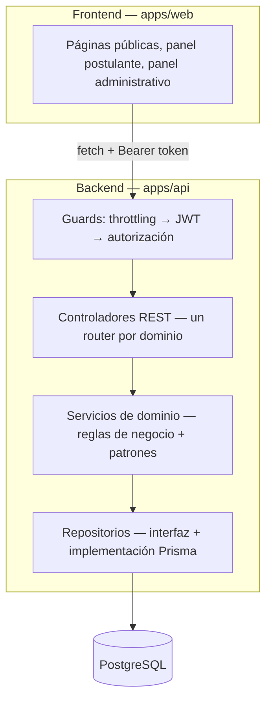
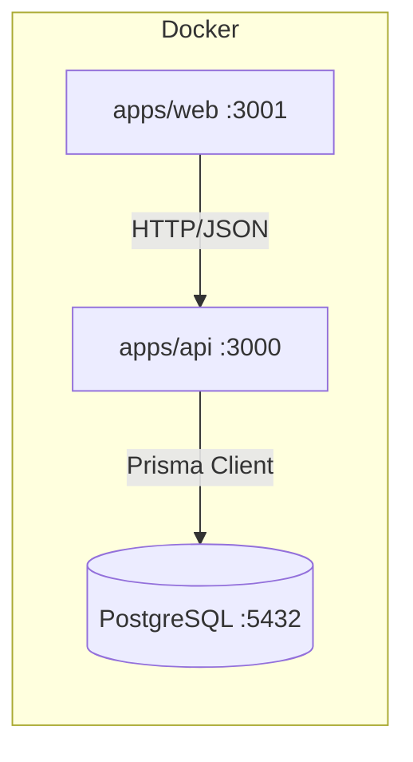
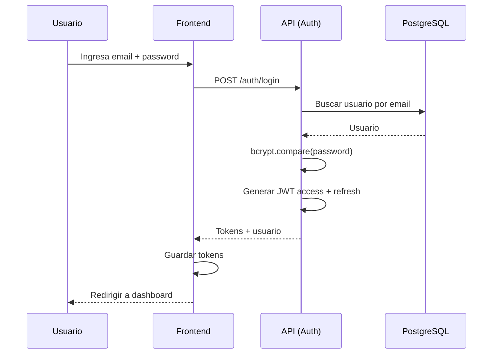
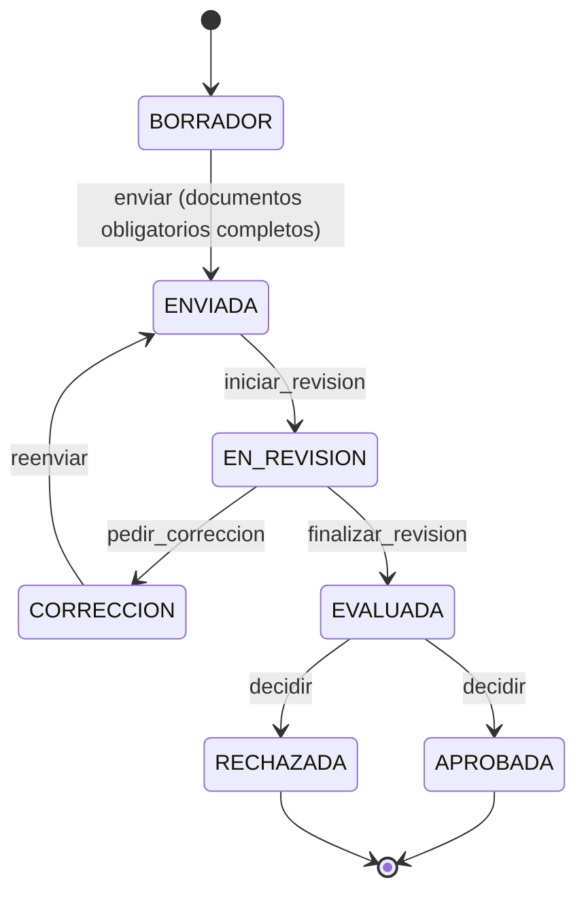
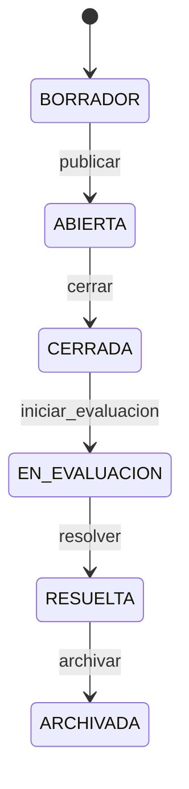
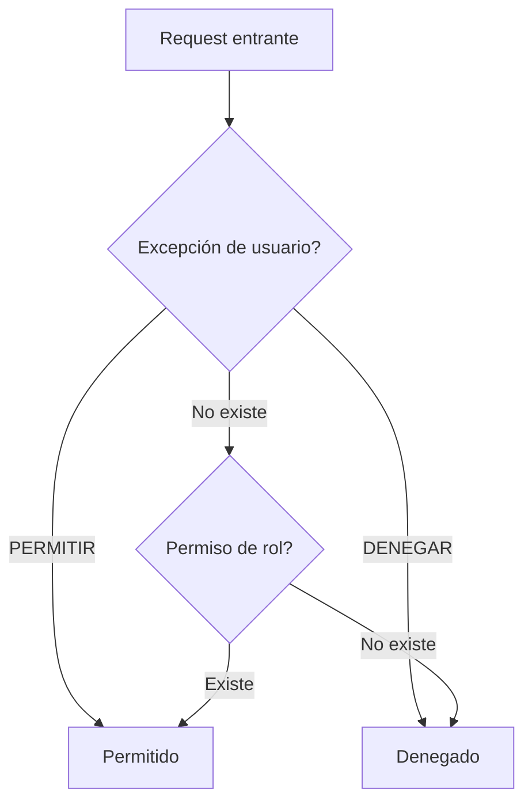
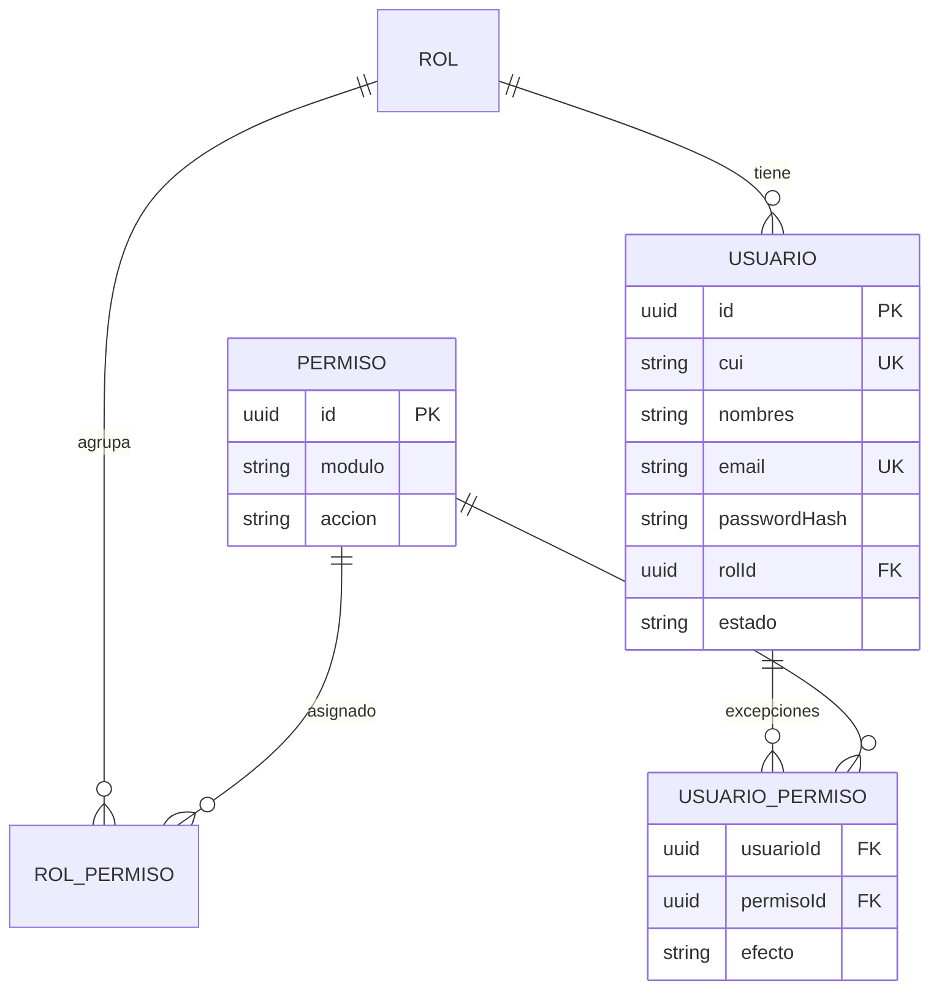
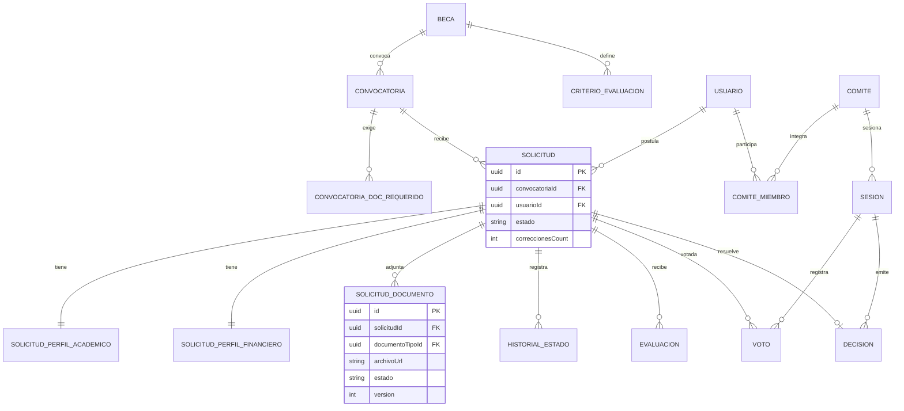
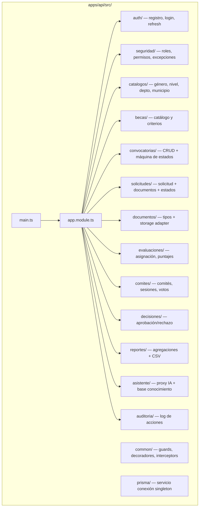

# Diagramas — SIGEB

> Diagramas Mermaid de arquitectura, despliegue y flujos.

---

## Arquitectura general

---

## Despliegue

---

## Flujo de autenticación

---

## Flujo de solicitud (ciclo de vida)

---

## Flujo de convocatoria

---

## Cadena de permisos (Chain of Responsibility)

---

## Modelo de datos (seguridad)

---

## Modelo de datos (becas)

---

## Estructura de carpetas backend

---

*Última actualización: 2026-08-26*
